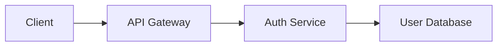

# Plan Mode - Strategic Planning & Architecture

## Overview

Plan Mode is a specialized AI interaction mode in OpenCodeBrew designed for strategic thinking, architectural design, and task planning **before** writing any code. It helps you explore different approaches, understand trade-offs, and create actionable implementation plans with **interactive todo lists** that persist to `.plan.md` files.

## Key Features at a Glance

✨ **Interactive Todo Lists** - Add, edit, delete, and check off tasks  
📁 **Persistent Plans** - Save plans to `.plan.md` files in your workspace  
🔄 **Live Sync** - Tasks update in real-time and save to file  
📊 **Visual Architecture** - Mermaid diagrams for system design  
🎯 **Multiple Approaches** - Compare solutions with pros/cons  
📤 **Export** - Copy plans as markdown to clipboard  

## When to Use Plan Mode

Use Plan Mode when you need to:

- **Design new features or systems** - Think through architecture before coding
- **Evaluate technology choices** - Compare different approaches and libraries
- **Refactor large codebases** - Plan the strategy and break down the work
- **Make architectural decisions** - Explore pros and cons of different patterns
- **Break down complex problems** - Decompose large tasks into manageable steps
- **Create project roadmaps** - Plan implementation phases and dependencies

## Key Features

### 1. Structured Planning

Plan Mode uses structured formats to organize information clearly:

#### Implementation Plans

Comprehensive plans with:
- **Overview** - High-level description of the goal
- **Multiple Approaches** - Different solutions with pros/cons
- **Task Breakdown** - Step-by-step implementation checklist
- **Architecture Diagrams** - Visual system design with Mermaid
- **Considerations** - Important factors to keep in mind

#### Checklists

Simple task lists for straightforward features with checkboxes for tracking progress.

#### Decision Matrices

Side-by-side comparison tables for evaluating options across multiple criteria.

### 2. Visual Architecture

Plan Mode automatically generates Mermaid diagrams to visualize:
- System architecture and component relationships
- Data flow between services
- State management patterns
- API design and endpoints

### 3. Multiple Perspectives

The AI presents different approaches to problems, highlighting:
- **Pros** - Benefits and advantages
- **Cons** - Drawbacks and limitations
- **Recommended** - Which approach is best for your use case

### 4. Export Functionality

Export any plan as Markdown to:
- Share with your team
- Store in documentation
- Track in project management tools
- Reference during implementation

### 5. Interactive Todo Lists ⭐ NEW

Cursor-style task management with full CRUD operations and persistent `.plan.md` files:

**Task Operations:**
- ✓ Check/uncheck tasks to track completion
- ✏️ Edit task text inline
- 🗑 Delete unnecessary tasks
- ➕ Add new tasks on the fly

**Persistent Storage:**
- Save plans to `.plan.md` files in workspace
- Tasks sync between UI and file
- Version control friendly markdown format
- Track progress across sessions

## Interactive Todo List Guide

### Managing Tasks

Once a plan is generated, the tasks section becomes fully interactive:

**Check Off Completion:**
- Click checkbox next to any task
- Completed tasks show strikethrough
- Progress counter updates (e.g., "3/10 completed")

**Edit Task Text:**
1. Click the edit icon (✎) on any task
2. Modify the task text
3. Press `Enter` to save or `Esc` to cancel

**Delete Tasks:**
- Click the trash icon (🗑) to remove a task
- Useful for cleaning up outdated or duplicate items

**Add New Tasks:**
1. Type in the "Add a new task..." field at bottom
2. Press `Enter` or click "Add Task" button
3. New task appears instantly in the list

### Saving to .plan.md Files

Every plan can be persisted to your workspace:

**Save a Plan:**
1. Click "Save to File" button in plan header
2. File is automatically created as `.plan-{title}.md`
3. All tasks, approaches, and diagrams are saved
4. Notification confirms save location

**File Location:**
```
📁 your-workspace/
├── .plan-user-authentication.md
├── .plan-database-refactoring.md  
└── .plan-real-time-features.md
```

**Update a Plan:**
1. Modify tasks (add, edit, check, delete)
2. Click "Save to File" again
3. Existing file is updated with current state

### Plan File Format

Saved `.plan.md` files include:

```markdown
# Plan Title

> Plan created: 4/11/2026, 2:30:45 PM

## Overview
High-level description...

## Approaches

### Option 1 ⭐ (Recommended)
**Pros:**
- Benefit 1
- Benefit 2

**Cons:**
- Drawback 1

## Tasks

- [x] Completed task
- [ ] Pending task  
- [ ] Another pending task

## Architecture

\`\`\`mermaid
graph LR
  ...
\`\`\`

## Considerations
- Important note 1
- Important note 2

---

*This plan is managed by OpenCodeBrew.*
```

### Workflow Example

**Day 1 - Planning:**
1. Enter Plan Mode
2. Ask: "Design an API authentication system"
3. Review AI-generated plan with 8 tasks
4. Add 2 custom tasks for testing
5. Click "Save to File" → creates `.plan-api-auth.md`

**Day 2 - Implementation:**
1. Open `.plan-api-auth.md` to review
2. Complete "Set up JWT middleware" ✓
3. Complete "Create user model" ✓  
4. Edit "Add validation" → "Add JWT validation with expiry"
5. Save file to update

**Day 3 - Completion:**
1. Check off remaining tasks
2. Delete "Research options" (no longer needed)
3. Add "Write API documentation"
4. Save final state
5. Plan shows 9/10 tasks completed

### Best Practices

**Task Organization:**
- Start with AI-generated tasks as baseline
- Break large tasks into 2-3 smaller ones
- Use specific, actionable task names
- Delete obsolete tasks as plans evolve

**File Management:**
- Save plans early and update often
- One `.plan.md` file per major feature
- Commit plan files to version control
- Review plans before starting work

**Progress Tracking:**
- Check off tasks as you complete them
- Keep task list current during development
- Use completed tasks to track velocity
- Export for status reports and standups

**Team Collaboration:**
- Share `.plan.md` files in PRs
- Team members can view progress
- Discuss approaches in code reviews
- Reference tasks in commit messages

## How to Use

### Starting a Planning Session

1. **Select Plan Mode** from the mode dropdown in the AI panel
2. **Choose a template** from the suggestions or write your own prompt
3. **Provide context** about your project and requirements
4. **Review the plan** with its approaches, tasks, and architecture
5. **Export if needed** using the copy button in the plan header

### Example Prompts

**Feature Design:**
```
Help me design a user authentication system. What are the different 
approaches (JWT vs sessions vs OAuth) and their trade-offs for a 
React + Express application?
```

**Refactoring:**
```
I need to refactor the database layer from Mongoose to Prisma. 
Help me plan the migration approach and break down the work into phases.
```

**Technology Evaluation:**
```
Compare WebSockets, Server-Sent Events, and polling for implementing 
real-time notifications. Which is best for a chat application?
```

**Task Breakdown:**
```
Break down the task of adding a dark mode feature into implementation 
steps, including theme context, CSS variables, and persistence.
```

**Architecture Design:**
```
Design a microservices architecture for an e-commerce platform. 
Show the services, their responsibilities, and how they communicate.
```

## Planning Templates

Plan Mode provides starter templates for common scenarios:

### Design Authentication System
Explores different authentication approaches (JWT, sessions, OAuth) with security considerations and implementation steps.

### Plan a Refactoring
Helps structure large refactoring efforts with risk assessment, testing strategy, and phased rollout.

### Evaluate Technology Options
Compares multiple solutions across relevant criteria with decision matrix and recommendations.

### Break Down a Feature
Decomposes a feature into granular tasks with dependencies and estimated complexity.

## Structured Output Formats

### Full Implementation Plan

```xml
<plan title="Feature: User Authentication">
<overview>
High-level description of what we're building and why.
</overview>

<approach name="Option 1: JWT Tokens" recommended="true">
<pros>
- Stateless and scalable
- Works well with microservices
</pros>
<cons>
- Token invalidation challenges
- Requires secure storage
</cons>
</approach>

<approach name="Option 2: Session-based">
<pros>
- Simpler to implement
- Easy to invalidate
</pros>
<cons>
- Requires stateful server
- Scaling challenges
</cons>
</approach>

<tasks>
- [ ] Set up authentication middleware
- [ ] Create user model and schema
- [ ] Implement login/logout endpoints
- [ ] Add token validation
- [ ] Write auth flow tests
</tasks>

<architecture>

</architecture>

<considerations>
- Security: Hash passwords with bcrypt
- Performance: Cache tokens in Redis
- UX: Implement refresh token flow
</considerations>
</plan>
```

### Simple Checklist

```xml
<checklist title="Add Dark Mode">
- [ ] Define color CSS variables
- [ ] Create theme context/store
- [ ] Add toggle in settings
- [ ] Persist to localStorage
- [ ] Test all components
</checklist>
```

### Decision Matrix

```xml
<decision question="Which state management library?">
| Criteria | Redux | Zustand | Jotai |
|----------|-------|---------|-------|
| Learning curve | Complex | Simple | Simple |
| Bundle size | Large | Small | Tiny |
| DevTools | Excellent | Good | Basic |

**Recommendation:** Zustand for this project.
</decision>
```

## UI Components

### Plan View

- **Collapsible sections** - Expand/collapse different parts of the plan
- **Color-coded approaches** - Green badge for recommended option
- **Interactive checklists** - Check off tasks as you complete them
- **Embedded diagrams** - Mermaid charts render inline
- **Export button** - Copy plan as Markdown

### Visual Indicators

- 📋 **Plan icon** - Indicates a structured plan
- ✓ **Checklist icon** - For simple task lists
- 🤔 **Decision icon** - For comparison matrices
- ⭐ **Recommended badge** - Highlights suggested approach
- ✓ **Pros** - Green indicators for benefits
- ✗ **Cons** - Red indicators for drawbacks

## Best Practices

### For Effective Planning

1. **Provide Context** - Share relevant project details, tech stack, and constraints
2. **Be Specific** - Clearly state your goals and requirements
3. **Ask Questions** - Don't hesitate to ask for clarifications
4. **Iterate** - Refine the plan with follow-up questions
5. **Export Early** - Save plans before switching modes

### What Plan Mode Does NOT Do

- ❌ Write actual code
- ❌ Create or edit files
- ❌ Execute commands
- ❌ Install packages

Plan Mode is **read-only** and focused entirely on strategic thinking and design.

### Transitioning to Implementation

After creating a plan in Plan Mode:

1. **Export the plan** for reference
2. **Switch to Agent Mode** or **Edit Mode**
3. **Reference the plan** in your prompts
4. **Implement step by step** following the task breakdown

Example transition:
```
[In Plan Mode] "Design a REST API for blog posts"
[Export plan]
[Switch to Agent Mode]
[In Agent Mode] "Based on the plan we created, implement the blog 
post API endpoints with Express and TypeScript"
```

## Example Workflow

### Scenario: Adding Real-time Features

**Step 1: Planning Session**
```
User: "What are the options for adding real-time notifications? 
Compare the approaches."

AI: [Generates plan with 3 approaches: WebSockets, SSE, Polling]
- WebSockets: Pros (bidirectional, efficient) vs Cons (complex, scaling)
- SSE: Pros (simple, HTTP-based) vs Cons (one-way only)
- Polling: Pros (dead simple) vs Cons (inefficient)

Recommendation: SSE for read-only notifications

[Shows architecture diagram with event flow]

Tasks:
- [ ] Set up SSE endpoint
- [ ] Create event emitter service
- [ ] Handle client reconnection
- [ ] Add authentication
- [ ] Test with multiple clients
```

**Step 2: Export & Switch**
- Click export button → Plan copied to clipboard
- Paste into project docs or issue tracker
- Switch to Agent Mode

**Step 3: Implementation**
```
User: "Based on the plan, implement the SSE notification system"

AI: [Creates files, sets up endpoints, adds authentication]
```

## Keyboard Shortcuts

When viewing plans:
- **Click section headers** - Expand/collapse sections
- **Check boxes** - Mark tasks complete
- **Copy button** - Export plan to clipboard

## Advanced Features

### Multi-Phase Planning

For large projects, break planning into phases:

1. **Phase 1:** High-level architecture
2. **Phase 2:** Detailed component design
3. **Phase 3:** API contract design
4. **Phase 4:** Data model design
5. **Phase 5:** Testing strategy

### Collaborative Planning

Plans can be exported and shared with:
- Team members for review
- Project managers for scheduling
- Stakeholders for approval
- Documentation systems

### Decision Documentation

Use Plan Mode to document architectural decisions:
- Context and problem statement
- Considered alternatives
- Chosen solution and rationale
- Consequences and trade-offs

## Tips & Tricks

### Getting Better Plans

1. **Start broad, then narrow** - Begin with high-level architecture, then drill into specifics
2. **Mention constraints** - Share budget, timeline, team size, or technical limitations
3. **Describe the user** - Explain who will use this and how
4. **Share existing stack** - Mention your current technologies for compatible suggestions
5. **Ask "why"** - Request explanations for recommendations

### Common Patterns

**Comparing Options:**
"Compare X vs Y vs Z for [use case]. Show pros/cons and recommend one."

**Breaking Down Work:**
"Break down [feature/task] into implementation steps with dependencies."

**Designing Architecture:**
"Design the architecture for [system]. Show components and data flow."

**Evaluating Approaches:**
"What are different ways to implement [feature]? Which is best for [context]?"

### Combining with Other Modes

Plan Mode works best as the **first step** in a larger workflow:

1. **Plan Mode** - Design and strategize
2. **Agent Mode** - Create files and structure
3. **Edit Mode** - Refine and polish
4. **Chat Mode** - Ask questions and debug

## Troubleshooting

### Plan Not Structured

If the AI doesn't use structured formats:
- Explicitly ask for "a structured plan with approaches and tasks"
- Reference the format: "Use the plan format with pros, cons, and architecture"

### Too Much Detail

If the plan is overwhelming:
- Ask for "a high-level plan focusing on the main decisions"
- Request "just the key steps without implementation details"

### Not Enough Context

If recommendations seem generic:
- Share more about your project, stack, and constraints
- Provide examples of similar features you've built
- Mention team experience level

## Related Features

- **Agent Mode** - For implementing the plan with file operations
- **Edit Mode** - For making changes to existing code
- **Mermaid Diagrams** - Automatically rendered in plans
- **Export** - Save plans as Markdown

## Future Enhancements

Planned improvements:
- Save plans to workspace for reference
- Convert plans to GitHub issues
- Track task completion across sessions
- Compare multiple plan versions
- Integration with project management tools
- Collaborative plan editing
- Plan templates library

## Feedback

Plan Mode is designed to make strategic thinking and architecture design more structured and collaborative. Share your feedback to help improve it!

---

**Remember:** Plan Mode is about thinking before coding. Use it to explore, evaluate, and design before jumping into implementation. The best code starts with a solid plan.
