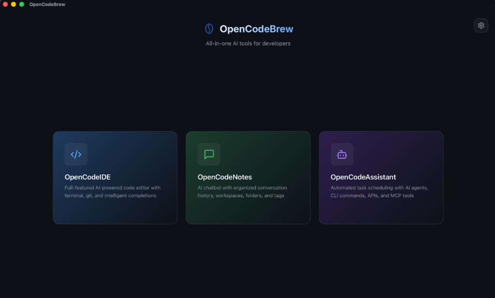
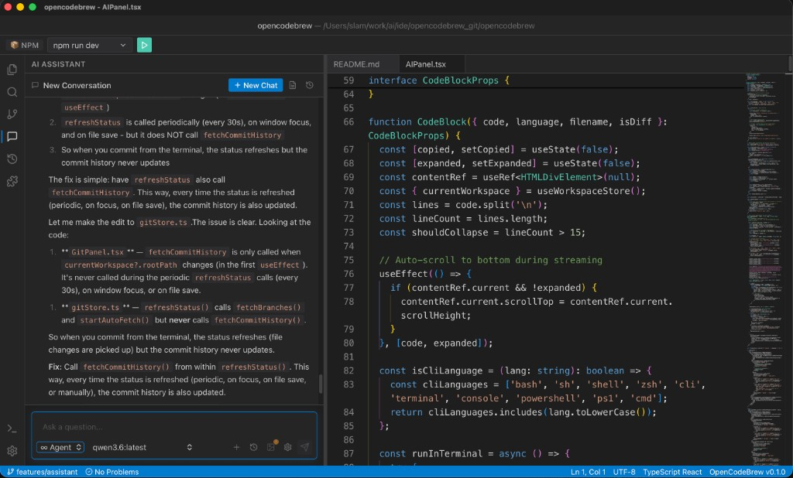
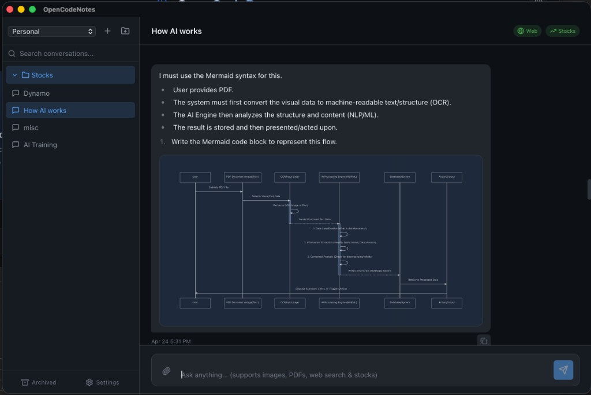
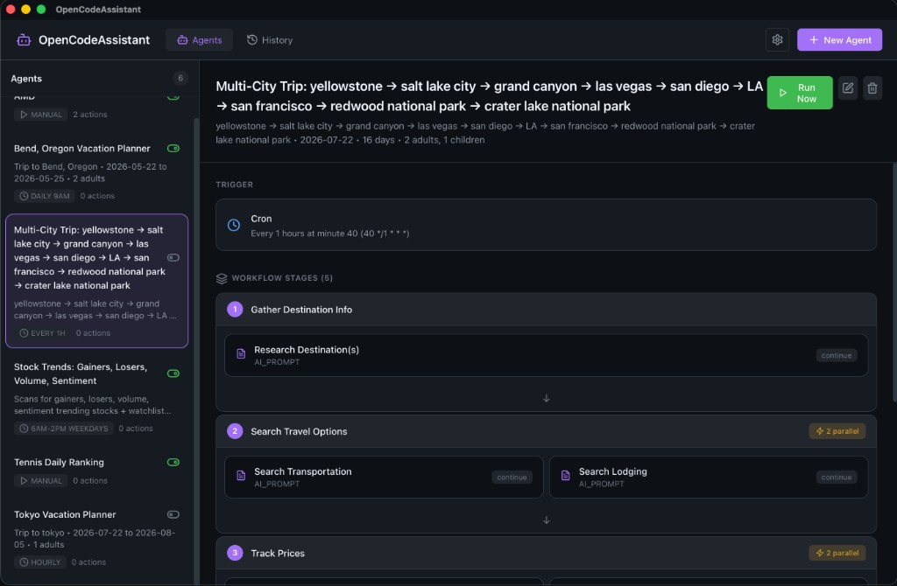
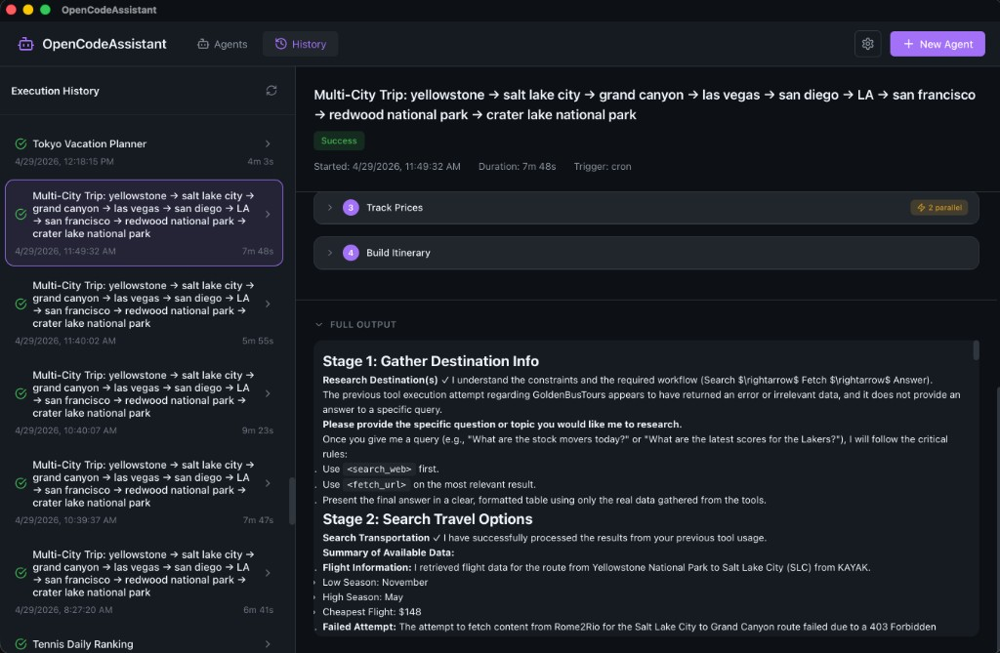

# OpenCodeBrew

A modern, cross-platform desktop IDE built with Tauri (Rust) + React + TypeScript. Features an IntelliJ-inspired UX with integrated AI assistant, Git support, and local history.

## Features

- **IntelliJ-style Layout**: Resizable panels, activity bar, tool windows
- **Monaco Editor**: VS Code's editor with syntax highlighting for 50+ languages
- **File Browser**: Navigate projects with tree view, icons, context menus
- **Integrated Terminal**: Xterm.js with PTY support
- **Git Integration**: Native git operations via libgit2 (no shell dependency)
- **AI Assistant**: Multi-backend support (Ollama, Claude, OpenAI)
- **Dev Team Mode**: Multi-agent workflow with TPM, Architect, TDD, and Review agents
- **PR Review Mode**: Multi-agent code review for PRs, commits, and local changes
- **Local History**: SQLite-backed file history with diff viewer
- **CLI Integration**: Run Claude Code, OpenCode, or custom CLI tools
- **Plugin System**: Extend functionality with JavaScript/TypeScript plugins
- **Cross-Platform**: macOS, Windows, Linux support via Tauri

## Screenshots

**Launcher hub**



**IDE workspace with AI assistant**



**OpenCodeNotes**



**OpenCodeAssistant — Agents**



**OpenCodeAssistant — History**



## Architecture

```
opencodebrew/
├── apps/ide/src/          # React frontend (TypeScript)
│   ├── components/        # UI components
│   │   └── AI/            # AI panel, Dev Team mode UI
│   │       ├── DevTeamController.tsx  # Workflow UI controller
│   │       ├── PRReviewInput.tsx      # PR/commit/local diff selector
│   │       ├── QuestionQueue.tsx      # Structured question UI
│   │       ├── CheckpointCard.tsx     # Approval gate UI
│   │       └── WorkflowProgress.tsx   # Agent progress display
│   ├── store/             # Zustand state management
│   │   ├── aiStore.ts     # AI conversation state
│   │   ├── questionStore.ts    # Question queue (Dev Team)
│   │   ├── workflowStore.ts    # Workflow state (Dev Team)
│   │   └── workflowOrchestratorStore.ts  # Agent orchestration
│   ├── types/             # TypeScript interfaces
│   │   ├── questions.ts   # Question/workflow types
│   │   └── workflow.ts    # Agent orchestration types
│   ├── utils/             # Shared utilities
│   │   └── diffUtils.ts   # Diff parsing/formatting
│   └── services/          # Tauri API bindings
├── apps/ide/config/prompts/  # AI prompt templates
│   ├── agent-mode.md      # Standard agent mode
│   ├── dev-team-mode.md   # TPM agent (Dev Team)
│   └── agents/            # Specialized agent prompts
│       ├── architect.md
│       ├── code-reviewer.md
│       ├── pr-code-reviewer.md  # PR review optimized
│       ├── security-reviewer.md
│       ├── tdd-guide.md
│       ├── performance-optimizer.md
│       └── verification.md
├── src-tauri/             # Rust backend
│   └── src/
│       ├── commands/      # IPC command handlers
│       │   ├── fs.rs      # File system operations
│       │   ├── git.rs     # Git operations (libgit2)
│       │   ├── ai.rs      # AI chat streaming
│       │   ├── terminal.rs # PTY terminal
│       │   └── history.rs # Local history (SQLite)
│       └── lib.rs         # Tauri app setup
└── package.json
```

### Dev Team Mode Architecture

```
┌─────────────────────────────────────────────────────────────────┐
│                        DevTeamController                         │
│  - Workflow selection UI                                        │
│  - Start/pause/cancel controls                                  │
└─────────────────────────────────────────────────────────────────┘
                                │
                                ▼
┌─────────────────────────────────────────────────────────────────┐
│                  WorkflowOrchestratorStore                       │
│  - Agent sequencing and dependencies                            │
│  - Checkpoint management                                        │
│  - Handoff document routing                                     │
│  - Event emission (AGENT_STARTED, CHECKPOINT_REACHED, etc.)     │
└─────────────────────────────────────────────────────────────────┘
                                │
          ┌─────────────────────┼─────────────────────┐
          ▼                     ▼                     ▼
┌─────────────────┐  ┌─────────────────┐  ┌─────────────────┐
│  QuestionStore  │  │  WorkflowStore  │  │    AIStore      │
│  - XML parsing  │  │  - Stage state  │  │  - Conversations│
│  - Answer queue │  │  - Progress     │  │  - Streaming    │
└─────────────────┘  └─────────────────┘  └─────────────────┘
          │                     │                     │
          ▼                     ▼                     ▼
┌─────────────────┐  ┌─────────────────┐  ┌─────────────────┐
│  QuestionQueue  │  │WorkflowProgress │  │  CheckpointCard │
│  - Multi-choice │  │  - Agent status │  │  - Approval UI  │
│  - Blocking     │  │  - Progress bar │  │  - Feedback     │
└─────────────────┘  └─────────────────┘  └─────────────────┘
```

**Key Design Decisions:**

1. **Zustand with Persistence**: Workflow state survives page refreshes
2. **Event-Driven**: Loose coupling via WorkflowEvent emissions
3. **Typed Handoffs**: Structured documents (RequirementsHandoff, ArchitectureHandoff, etc.)
4. **XML Question Parsing**: Agents emit `<ask_questions>` tags that the UI intercepts
5. **Checkpoint Gates**: User approval required before proceeding to next phase

## Prerequisites

- **Node.js** 18+
- **Rust** 1.77+ (install via [rustup](https://rustup.rs))
- **System dependencies** (for Tauri):
  - macOS: Xcode Command Line Tools
  - Linux: `sudo apt install libwebkit2gtk-4.1-dev build-essential curl wget file libssl-dev libayatana-appindicator3-dev librsvg2-dev`
  - Windows: [Microsoft C++ Build Tools](https://visualstudio.microsoft.com/visual-cpp-build-tools/)

### Optional Dependencies (for AI Web Search)

The AI assistant uses text-based browsers for reliable web search. Install for best results:

```bash
# macOS (recommended)
brew install lynx w3m

# Linux (Debian/Ubuntu)
sudo apt install lynx w3m

# Linux (Fedora/RHEL)
sudo dnf install lynx w3m
```

Without these, the assistant falls back to slower/less reliable methods (headless browser, HTTP scraping).

**Search API (optional)**: Set `BRAVE_SEARCH_API_KEY` environment variable for Brave Search API access.

## Development

```bash
# Install dependencies
npm install

# Run in development mode (with hot reload)
npm run tauri:dev

# Build for production
npm run tauri:build
```

## Cross-Platform Build

Tauri supports building for all platforms:

```bash
# macOS (from macOS)
npm run tauri:build

# Windows (from Windows)
npm run tauri:build

# Linux (from Linux)
npm run tauri:build
```

For cross-compilation, use GitHub Actions or similar CI/CD.

## Configuration

### AI Providers

Configure AI backends in the Settings panel:

- **Ollama** (local): `http://localhost:11434`
- **Claude**: Add your Anthropic API key
- **OpenAI**: Add your OpenAI API key
- **Custom**: Any OpenAI-compatible endpoint

**Web Search**: The AI assistant can search the web using `lynx` or `w3m` text browsers. For best results, install these tools (see Optional Dependencies above).

### Dev Team Mode

Dev Team Mode orchestrates multiple specialized AI agents to collaboratively build features. Instead of a single AI assistant, you get a full development team:

```
User Request → TPM → Architect → TDD Guide → Developer → Code Review → Verification
                ↓         ↓                                              ↓
           [Checkpoint] [Checkpoint]                              [Checkpoint]
```

#### Agents

| Agent | Role | Output |
|-------|------|--------|
| **TPM Agent** | Gathers requirements through structured questions | Requirements Document |
| **Architect Agent** | Designs system architecture and technical approach | Architecture Document with ADRs |
| **TDD Guide Agent** | Creates test specifications before implementation | Test specifications |
| **Developer Agent** | Implements code following architecture and tests | Working code |
| **Code Reviewer Agent** | Reviews code quality, patterns, and maintainability | Code Review Report |
| **Security Reviewer Agent** | Checks for vulnerabilities (OWASP Top 10) | Security Report |
| **Performance Optimizer Agent** | Analyzes bundle size, Web Vitals, algorithms | Performance Report |
| **Verification Agent** | Final gate: build, test, lint, security checks | Verification Report |

#### Workflow Contexts

- **New Feature**: Full lifecycle with architecture review (8 agents)
- **Bug Fix**: Streamlined path: TPM → Developer → Verification (3 agents)
- **Refactor**: Code quality focus with review emphasis
- **New Project**: Complete project setup from scratch
- **PR Review**: Multi-agent code review for PRs, commits, or local changes (4 agents)

#### Checkpoints

The workflow pauses at key points for user approval:

1. **Requirements Review** — Approve requirements before architecture
2. **Architecture Review** — Approve design before implementation
3. **Final Verification** — Approve code before merge

#### Structured Questions

Agents ask structured questions using an interactive UI (similar to Cursor's AskQuestion):

```xml
<ask_questions blocking="true" category="scope">
  <question id="scope-level" required="true">
    <prompt>What scope level for this implementation?</prompt>
    <option id="mvp" recommended="true">MVP - Core functionality only</option>
    <option id="full">Full - Complete feature set</option>
  </question>
</ask_questions>
```

#### Using Dev Team Mode

1. Select **👥 Dev Team** from the mode dropdown
2. Choose your workflow context (New Feature, Bug Fix, etc.)
3. Click **Start Dev Team Workflow**
4. Answer the TPM's questions about your requirements
5. Approve checkpoints as the workflow progresses
6. Review the final verification report

#### PR Review Mode

PR Review provides multi-agent code review that runs your changes through specialized reviewers:

```
PR/Commit/Local → Code Reviewer → Security Reviewer → Performance Optimizer → Verdict
                        ↓                ↓                    ↓                 ↓
                  Code Quality      OWASP Top 10         Bundle Impact    Combined Report
                                                                              ↓
                                                                        [Checkpoint]
```

**Review Sources:**

| Source | Description |
|--------|-------------|
| **Local Changes** | Review uncommitted changes (staged + unstaged) |
| **Pull Request** | Fetch and review a PR from GitHub/GitLab |
| **Commit** | Review a single commit or commit range |

**Using PR Review:**

1. Select **👥 Dev Team** from the mode dropdown
2. Choose **PR Review** context
3. Select your review source:
   - **Local Changes**: Click "Fetch & Prepare Review" to analyze uncommitted changes
   - **Pull Request**: Select provider, load PRs (requires GitHub/GitLab token in Settings), pick a PR
   - **Commit**: Enter a commit hash or select from recent commits
4. Click **Start Multi-Agent Review**
5. Wait for each reviewer to complete:
   - Code Reviewer: Quality, style, error handling
   - Security Reviewer: OWASP vulnerabilities, secrets, injection risks
   - Performance Optimizer: Bundle impact, complexity, memory leaks
6. Review the combined verdict and fix checklist
7. Approve or request changes at the final checkpoint

**Review Output:**

The final report includes:
- **Findings by Severity**: CRITICAL, HIGH, MEDIUM, LOW, INFO
- **Overall Verdict**: APPROVE, REQUEST-CHANGES, or BLOCK
- **Fix Checklist**: Actionable items with file paths and line numbers
- **Risk Assessment**: Overall risk level for the changes

**GitHub/GitLab Integration:**

To review Pull Requests, configure your token in Settings → Git:
- GitHub: Personal Access Token with `repo` scope
- GitLab: Personal Access Token with `read_api` scope

### Workspaces

The IDE remembers recent workspaces. Open folders via:

- File menu → Open Folder
- Welcome tab → Open Folder button
- Drag & drop folder onto window

## Key Bindings


| Action    | macOS | Windows/Linux |
| --------- | ----- | ------------- |
| Save      | ⌘S    | Ctrl+S        |
| Save All  | ⌘⇧S   | Ctrl+Shift+S  |
| Open File | ⌘O    | Ctrl+O        |
| Find      | ⌘F    | Ctrl+F        |
| Terminal  | ⌘`    | Ctrl+`        |


## Why Tauri over Electron?

- **~80% smaller** bundle size (5-15MB vs 150MB+)
- **Lower memory** usage (native webview vs Chromium)
- **Better security** via Rust's memory safety
- **Native performance** for file operations and git

## Technology Stack

- **Frontend**: React 18, TypeScript, Zustand, Monaco Editor
- **Backend**: Rust, Tauri 2.0, libgit2, SQLite
- **IPC**: Tauri command/event system with streaming support
- **Build**: Vite (frontend), Cargo (backend)

## License

MIT