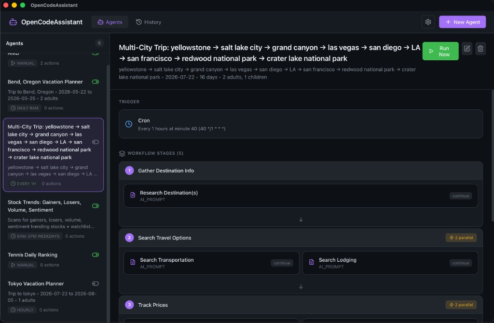
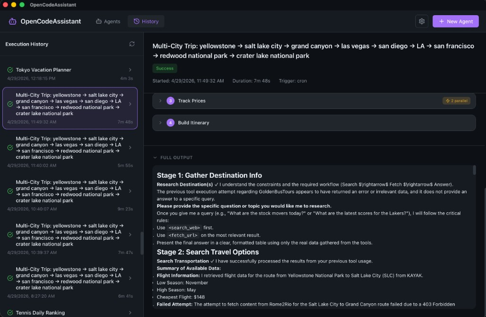

# Assistant

OpenCodeAssistant is an automation platform for creating AI-powered agents that run on schedules or triggers.

## Concepts

### Agents
An agent is an automated workflow that:
- Runs on a schedule (cron) or manually
- Executes a series of actions (stages)
- Can send notifications when complete

### Stages
Stages are groups of actions that run sequentially. Actions within a stage can run in parallel.

### Actions
Individual tasks like:
- AI prompts
- API calls
- CLI commands
- File operations
- Notifications (Discord, Slack, Email)

## Creating an Agent

### From Templates
1. Click **+ New Agent**
2. Browse available templates
3. Configure template options
4. Click **Create Agent**

### Available Templates

| Template | Description |
|----------|-------------|
| **Trending Stocks** | Monitor stock market trends and get reports |
| **Travel Planner** | Research and plan trips with AI |
| **Custom** | Build your own workflow from scratch |

### From Scratch
1. Click **+ New Agent** → **Custom**
2. Add stages and actions
3. Configure triggers
4. Save and enable

## Workflow Builder

### Adding Stages
1. Click **+ Add Stage**
2. Name your stage
3. Add actions to the stage

### Action Types

| Type | Description |
|------|-------------|
| **AI Prompt** | Send a prompt to the AI and get a response |
| **API Call** | Make HTTP requests to external APIs |
| **CLI Command** | Run shell commands |
| **MCP Tool** | Use Model Context Protocol tools |
| **Save File** | Write output to a file |
| **Send Email** | Send email notifications |
| **Send Slack** | Post to Slack channels |
| **Send Discord** | Post to Discord webhooks |

### Variable Substitution
Use variables in your prompts and actions:

- `{{previous_output}}` - Output from the previous stage
- `{{stage_N_output}}` - Output from stage N
- `{{action_name_output}}` - Output from a specific action
- `{{datetime}}` - Current date and time
- `{{date}}` - Current date
- `{{timestamp}}` - Unix timestamp

## Triggers

### Cron Schedule
Run agents on a schedule:

| Example | Description |
|---------|-------------|
| `0 9 * * 1-5` | 9 AM on weekdays |
| `30 16 * * *` | 4:30 PM daily |
| `0 */2 * * *` | Every 2 hours |

### Manual
Run agents on-demand by clicking the **Run** button.

## Execution History

View past runs in the **History** tab:

- Execution status (success/failed/cancelled)
- Duration
- Stage-by-stage output
- Error messages

### Cancelling Executions
If an agent is stuck or taking too long:
1. Go to Execution History
2. Select the running execution
3. Click **Cancel**

## Error Handling

Configure what happens when an action fails:

| Option | Behavior |
|--------|----------|
| **Stop** | Halt the entire workflow |
| **Continue** | Skip the failed action and continue |
| **Retry** | Retry the action up to 3 times |

## Notifications

### Discord
1. Create a webhook in your Discord server
2. Add a Discord action with the webhook URL
3. Customize the message format

### Slack
1. Create an incoming webhook in Slack
2. Add a Slack action with the webhook URL
3. Specify the channel

### Email
1. Configure SMTP settings
2. Add an Email action with recipients
3. Customize subject and body

## Best Practices

1. **Start Simple** - Begin with templates, then customize
2. **Test Manually** - Run agents manually before scheduling
3. **Use Stages** - Group related actions together
4. **Handle Errors** - Set appropriate error handling for each action
5. **Monitor History** - Check execution history regularly
