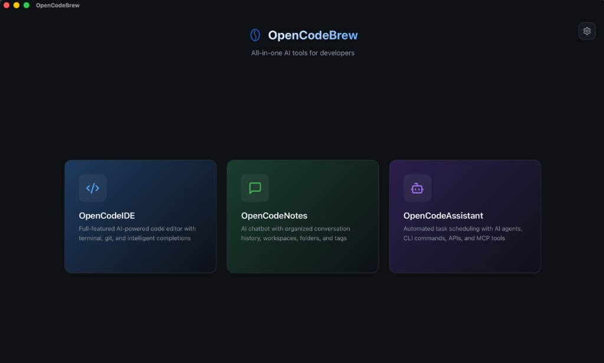

# Getting Started

This guide will help you get up and running with OpenCodeBrew in just a few minutes.

## Installation

### macOS
1. Download the `.dmg` file from the releases page
2. Open the DMG and drag OpenCodeBrew to your Applications folder
3. Launch OpenCodeBrew from Applications

### Windows
1. Download the `.msi` installer from the releases page
2. Run the installer and follow the prompts
3. Launch OpenCodeBrew from the Start menu

### Linux
1. Download the `.AppImage` or `.deb` package
2. For AppImage: Make executable with `chmod +x` and run
3. For .deb: Install with `sudo dpkg -i opencodebrew.deb`

## First Launch

When you first open OpenCodeBrew, you'll see the **Launcher** - your central hub for all applications.

## Configure AI (Recommended)

Click the **⚙️ Settings** icon in the top-right corner to configure your AI provider:

### Option 1: Ollama (Free, Local)
1. Install [Ollama](https://ollama.ai)
2. Run `ollama pull llama3` in terminal
3. In Settings, select "Ollama" as provider
4. Set URL to `http://localhost:11434`

### Option 2: OpenAI
1. Get an API key from [OpenAI](https://platform.openai.com/api-keys)
2. In Settings, select "OpenAI" as provider
3. Paste your API key

### Option 3: Anthropic (Claude)
1. Get an API key from [Anthropic](https://console.anthropic.com/)
2. In Settings, select "Anthropic" as provider
3. Paste your API key

### Option 4: GitHub Copilot
1. Ensure you have a GitHub Copilot subscription
2. In Settings, select "Copilot" as provider
3. Click "Sign in with GitHub" (OAuth) or "Sign in with GitHub (SSO)" for Enterprise SSO
4. Complete the authorization flow

## Choose Your App

From the Launcher, click on any app tile to open it:

- **IDE** - For coding projects with AI assistance
- **Notes** - For AI-powered note-taking and research
- **Assistant** - For automated tasks and scheduled agents

## Next Steps

- [Learn about the IDE](ide.md)
- [Explore Notes](notes.md)
- [Set up AI Agents](assistant.md)
- [View keyboard shortcuts](keyboard-shortcuts.md)
