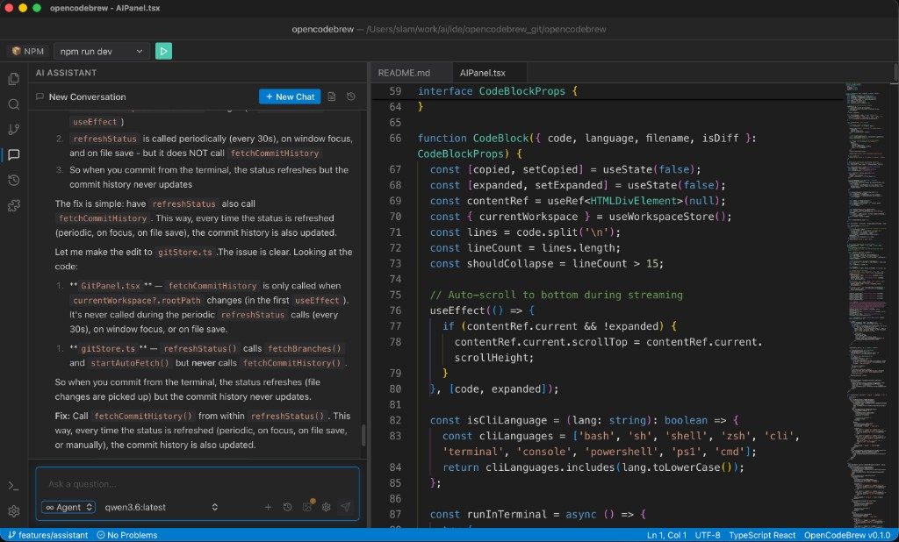

# IDE

The OpenCodeBrew IDE is a full-featured code editor with integrated AI assistance, Git support, and local history.



## Layout

### Activity Bar (Left)
The vertical bar on the left provides quick access to different panels:

| Icon | Panel | Description |
|------|-------|-------------|
| 📁 | Explorer | File tree browser |
| 🔍 | Search | Find and replace across files |
| 🌿 | Git | Source control operations |
| 🤖 | AI | AI assistant chat panel |

### File Explorer

- **Tree View** - Navigate your project files
- **Right-Click Menu** - Create, rename, delete files/folders
- **Drag & Drop** - Reorganize files

#### Context Menu Options
- New File / New Folder
- Rename
- Delete
- Copy Path / Copy Relative Path
- Reveal in Finder / Open in Terminal

### Editor

The editor uses Monaco (same as VS Code) with:

- Syntax highlighting for 50+ languages
- Code folding
- Multiple cursors
- Find and replace
- Minimap navigation

### Terminal

Press `` Ctrl+` `` (or `` ⌘` `` on macOS) to toggle the integrated terminal.

- Full PTY support
- Multiple terminal tabs
- Split terminals

## AI Assistant

The AI panel provides an intelligent coding assistant:

### Chat Mode
Ask questions about your code:
```
"Explain what this function does"
"How do I add error handling here?"
"What's the best way to optimize this loop?"
```

### Agent Mode
Let the AI make changes to your files:
```
"Add a loading spinner to this component"
"Refactor this class to use dependency injection"
"Write unit tests for this module"
```

### Edit Mode
Select code and ask for specific modifications:
```
"Convert this to async/await"
"Add TypeScript types"
"Simplify this logic"
```

### Attaching Context
- **@file** - Reference a specific file
- **@folder** - Include folder contents
- **Selected code** - Automatically includes your selection

## Git Integration

The Git panel shows:

- **Changes** - Modified, added, deleted files
- **Staged** - Files ready to commit
- **Branches** - Switch and create branches
- **History** - Commit log with diffs

### Common Operations
- Stage/Unstage files
- Commit changes
- Push/Pull from remote
- Create/switch branches
- View file diffs

## Local History

Every file save is tracked locally:

1. Click the clock icon in the editor toolbar
2. View previous versions with timestamps
3. Compare with current version
4. Restore any previous version

## Search

Press `Ctrl+Shift+F` (or `⌘⇧F` on macOS) for project-wide search:

- Regex support
- File type filters
- Include/exclude patterns
- Replace across files

## Keyboard Shortcuts

See [Keyboard Shortcuts](keyboard-shortcuts.md) for a complete list.
