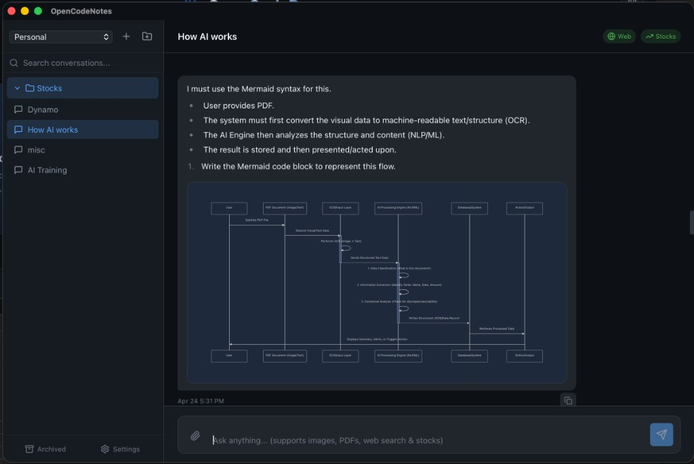

# Notes

OpenCodeNotes is an AI-powered note-taking application for research, brainstorming, and organizing information.



## Features

### Workspaces
Organize your notes into workspaces for different projects or topics.

- Create multiple workspaces
- Switch between workspaces easily
- Each workspace has its own folders and conversations

### Folders
Group related conversations into folders:

- Create nested folder structures
- Drag and drop to reorganize
- Color-code folders for visual organization

### Conversations
Each conversation is a chat thread with the AI:

- Full conversation history
- Markdown rendering
- Code syntax highlighting
- Export to Markdown or JSON

## Chat Interface

### Sending Messages
Type your message and press Enter (or click Send):

```
"Summarize the key points from this article"
"Help me brainstorm ideas for my project"
"Explain quantum computing in simple terms"
```

### Attachments
Attach files to provide context:

- **Images** - Drag & drop or click to attach
- **PDFs** - Extracts text for AI analysis
- **Documents** - Supports common formats

### Tools
The AI can use tools to help you:

- **Web Search** - Search the internet for current information
- **Stock Quotes** - Get real-time market data
- **URL Fetch** - Read and summarize web pages

## Formatting

Messages support full Markdown:

- **Bold** and *italic* text
- `Code blocks` with syntax highlighting
- Tables
- Lists and checkboxes
- Mathematical equations

## Tags
Add tags to conversations for easy filtering:

1. Click the tag icon on a conversation
2. Add or remove tags
3. Filter by tags in the sidebar

## Search
Find conversations quickly:

- Search by content
- Filter by date
- Filter by tags
- Search within a workspace or folder

## Export
Export conversations for backup or sharing:

- **Markdown** - Human-readable format
- **JSON** - Machine-readable with full metadata

## Settings

Access settings via the ⚙️ icon:

- AI model selection
- Temperature adjustment
- System prompt customization
- Theme preferences
